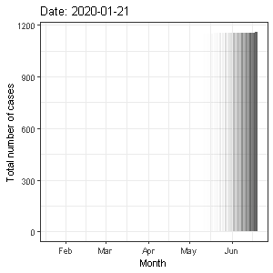

animate\_covid\_timeseries
================

I want to try out the [gganimate
package\!](https://gganimate.com/index.html) So I thought I’d try it out
on some covid time series data from New Zealand. I found some timeseries
data here:
<https://github.com/CSSEGISandData/COVID-19/blob/master/who_covid_19_situation_reports/who_covid_19_sit_rep_time_series/who_covid_19_sit_rep_time_series.csv>

## Get data

``` bash
git clone https://github.com/CSSEGISandData/COVID-19.git
```

*Note. I set the above code chunk to “eval = FALSE” and manually run it
once, to avoid the data being downloaded each time this document is
knitted*

## Load libraries

``` r
library(ggplot2)
library(gganimate)
```

    ## Warning: package 'gganimate' was built under R version 3.6.3

``` r
library(dplyr)
```

    ## 
    ## Attaching package: 'dplyr'

    ## The following objects are masked from 'package:stats':
    ## 
    ##     filter, lag

    ## The following objects are masked from 'package:base':
    ## 
    ##     intersect, setdiff, setequal, union

``` r
library(stringr)
library(lubridate)
```

    ## 
    ## Attaching package: 'lubridate'

    ## The following object is masked from 'package:base':
    ## 
    ##     date

``` r
library(gifski)
```

    ## Warning: package 'gifski' was built under R version 3.6.3

## Play around with data\!

Load
data

``` r
data <- read.csv("./COVID-19/who_covid_19_situation_reports/who_covid_19_sit_rep_time_series/who_covid_19_sit_rep_time_series.csv", header = TRUE, stringsAsFactors = FALSE)
```

Format columns (X has automatically been prepended, but using
“check.names = FALSE” causes even more problems)

``` r
names(data) <- sapply(str_remove_all(colnames(data),"X"),"[")
```

Extract NZ data

``` r
data_nz <- data %>%
  filter(Country.Region == "New Zealand")
```

Manipulate data

``` r
# Remove redundant columns
data_nz <- data_nz %>%
  select (-c(Province.States, WHO.region, WHO.region.label))

# Reformat the data for downstream plot
data_nz <- data_nz %>% tidyr::gather(date, "cases", na.rm = TRUE)

# Remove first row which is old column names after gather
data_nz <- data_nz %>% slice(-1)

# Format date column
data_nz$date <- data_nz$date %>%
  as.Date(format = "%m.%d.%y")

# Format case number column
data_nz$cases <- as.integer(data_nz$cases)
```

## Plot\!

``` r
plot <- ggplot(data_nz, aes(x = date, y = cases)) +
  geom_histogram(stat = "identity") +
  theme_linedraw() +
  labs(title = "Date: {frame_time}", y = "Number of cases") +
  transition_time(date) +
  ease_aes('linear') +
  shadow_wake(.3)
```

    ## Warning: Ignoring unknown parameters: binwidth, bins, pad

``` r
animate(plot, duration = 10, fps = 20, width = 300, height = 300, renderer = gifski_renderer())
```

<!-- -->

``` r
anim_save("covid_timeseries_NZ.gif", animation = last_animation(), path = ".")
```

## R info

``` r
R.Version()
```

    ## $platform
    ## [1] "x86_64-w64-mingw32"
    ## 
    ## $arch
    ## [1] "x86_64"
    ## 
    ## $os
    ## [1] "mingw32"
    ## 
    ## $system
    ## [1] "x86_64, mingw32"
    ## 
    ## $status
    ## [1] ""
    ## 
    ## $major
    ## [1] "3"
    ## 
    ## $minor
    ## [1] "6.1"
    ## 
    ## $year
    ## [1] "2019"
    ## 
    ## $month
    ## [1] "07"
    ## 
    ## $day
    ## [1] "05"
    ## 
    ## $`svn rev`
    ## [1] "76782"
    ## 
    ## $language
    ## [1] "R"
    ## 
    ## $version.string
    ## [1] "R version 3.6.1 (2019-07-05)"
    ## 
    ## $nickname
    ## [1] "Action of the Toes"

``` r
sessionInfo()
```

    ## R version 3.6.1 (2019-07-05)
    ## Platform: x86_64-w64-mingw32/x64 (64-bit)
    ## Running under: Windows 10 x64 (build 18363)
    ## 
    ## Matrix products: default
    ## 
    ## locale:
    ## [1] LC_COLLATE=English_United States.1252 
    ## [2] LC_CTYPE=English_United States.1252   
    ## [3] LC_MONETARY=English_United States.1252
    ## [4] LC_NUMERIC=C                          
    ## [5] LC_TIME=English_United States.1252    
    ## 
    ## attached base packages:
    ## [1] stats     graphics  grDevices utils     datasets  methods   base     
    ## 
    ## other attached packages:
    ## [1] gifski_0.8.6    lubridate_1.7.4 stringr_1.4.0   dplyr_0.8.3    
    ## [5] gganimate_1.0.7 ggplot2_3.2.0  
    ## 
    ## loaded via a namespace (and not attached):
    ##  [1] Rcpp_1.0.1        plyr_1.8.4        pillar_1.4.2     
    ##  [4] compiler_3.6.1    prettyunits_1.0.2 tools_3.6.1      
    ##  [7] progress_1.2.2    digest_0.6.20     evaluate_0.14    
    ## [10] tibble_2.1.3      gtable_0.3.0      pkgconfig_2.0.2  
    ## [13] rlang_0.4.0       yaml_2.2.0        xfun_0.8         
    ## [16] withr_2.1.2       knitr_1.23        hms_0.4.2        
    ## [19] grid_3.6.1        tidyselect_0.2.5  glue_1.3.1       
    ## [22] R6_2.4.0          rmarkdown_1.13    tidyr_0.8.3      
    ## [25] purrr_0.3.2       tweenr_1.0.1      farver_2.0.3     
    ## [28] magrittr_1.5      scales_1.0.0      htmltools_0.3.6  
    ## [31] assertthat_0.2.1  colorspace_1.4-1  labeling_0.3     
    ## [34] stringi_1.4.3     lazyeval_0.2.2    munsell_0.5.0    
    ## [37] crayon_1.3.4
